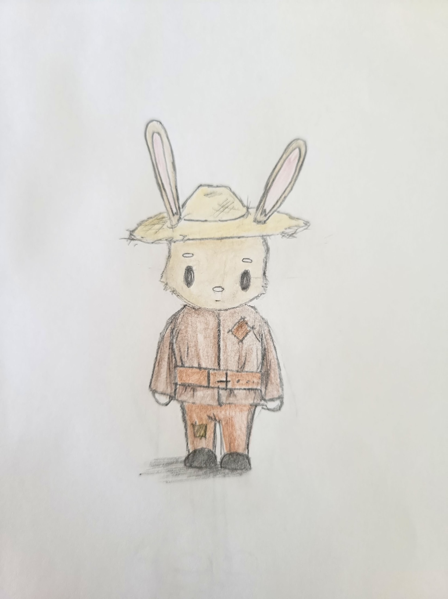

Once the earth was beginning to show serious signs of decline, Farmers were looking for some sort of paradise that they thought they could help rebuild the wrecked world around them. But once they were kicked out from the Seed Vault their role became even more important. The last generation of Farmers that actually worked with the seeds in the Seed Vault weren’t capable of fighting and thought that their skill set was better put towards helping their communities. They do a little bit of everything to help out and make their communities better, whether that be building new homes, making repairs, or farming to ensure everyone has enough food. In their community coalitions, they patrol to make sure the people are safe from threats by Frontier. 

There isn’t one set group of people that would make someone a right candidate for this role but it typically lends itself to those who love nature like gardeners and helping those who like to help others as this role is one that tends to give more than it receives. It is also good for those who want to be a part of the action but want to be able to take a more laid back approach. 

### Skills and Equipment
- **Core Skills**: Medicine, Reaction, Sneakiness, Deduction, Foraging
- **Unique Skill:** Revive plants (Can revive small dead plants)
- **Unique Expertise:** Cybernetics
- **Equipment:** Water canteen, Jar of white gel (Can be used as a base for medicinal ointment), Satchel
- **NPC Connection:** The Farmers all know Ernest Elderberry one of the village elders and they can go to him for help or information 

### Expertise Tree
|   |   |   |   |
|---|---|---|---|
| **Tier&nbsp;1** | **Cybernetics:** Begins with a rank 1 in cybernetics.                                 | **Farmer Trails:** Can tell which direction where someone went.                                                      | **Intimidator:** +2 to fear checks to get information.                                     |
| **Tier&nbsp;2** | **Locksmith:** Ability to hack basic electric locks without making a check.           | **Adept Tracker:** Can track for up to a mile before losing the trail.                                               | **Mind Terror:** Able to cause 1 psychic harm on a successful fear check (bypasses armor). |
| **Tier&nbsp;3** | **Advanced Cybernetics:** +3 to cybernetic checks for recovering or decrypting files. | **Natural Compass:** Can tell where someone went and also where they will likely be headed due to knowledge of area. | **Force of Fright:** Can add their fear modifier to attack rolls.                          |
