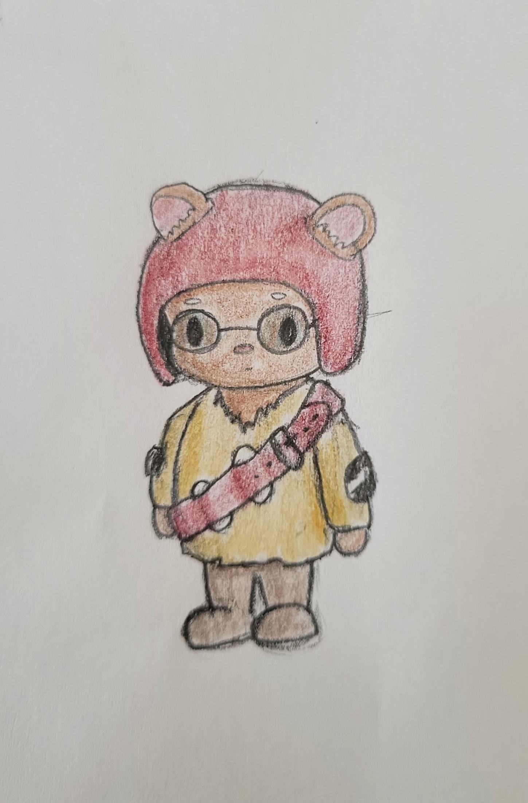

Seed Keepers are a group of scholars that take care of the seeds in the Seed Vault. They are responsible for cataloging, studying, and protecting the seeds. They have deep knowledge of plant species. Seed Keepers catalog every seed, maintaining a database that contains each species. Seed Keepers also have a strong understanding of the Seed Vault’s security and technology. After the Seed Vault was taken over by Frontier and they were fired from their jobs, Seed Keepers were in charge of documenting their life’s work of successful farming practices and healing powers. In the new villages, they also serve as doctors and nurses for both patients and plants. Seed Keepers possess five skills that enable them to serve as protectors of the seeds. 

### Skills and Equipment
- **Core Skills:** Leadership, Force, Bartering Insight, Sneakiness
- **Unique Skill:** PlantSpeak
- **Unique Expertise:** Keepers Insight
- **Equipment:** Data Tablet (Has information on the seed vault), Seed Kit (contains sample of rare seed), Old Seed Vault Key

### Expertise Tree
|   |   |   |   |
|---|---|---|---|
| **Tier&nbsp;1** | **Keepers Insight:** Uncover hidden motives or weaknesses. | **Silent Seed:** Move silently in secured areas.      | **Seed Strength:** +2 to physical strength and combat skills to defend the seed vault or other natural areas.                                                                |
| **Tier&nbsp;2** | **Keepers Foresight:** Predict enemies’ next move.         | **Sneaky Seed:** Become invisible in the environment. | **Seed Endurance:** Temporary boost, allowing Seed Keepers to soak 1 additional harm in a single combat encounter.                                                           |
| **Tier&nbsp;3** | **Seed Keeper Strategy:** Gain one strategic advantage.    | **Skilled Seed:** Perform actions while sneaking.     | **Seed Snipe:** Channel strength into precise attacks, increasing effectiveness against tough opponents. Deal an extra harm to opponents with a harm threshold of 8 or more. |
