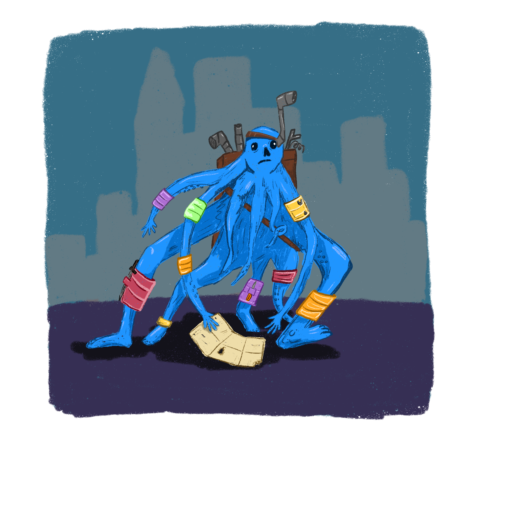

Scavengers are an essential part of the city of Karkorte as they help to maintain the infrastructure of the city. Due to the constant pressure of monster attacks on the city, more materials are needed in order to keep the city habitable. Scavengers are important because they know the land around the city and are able to efficiently harvest resources. You can say that they are the backbone of the city as without scavengers the city would have fallen many decades ago.

### Skills and Equipment

-   **Core Skills:** Foraging, Tracking, Insight, Thievery, Sneakiness
-   **Unique Skill:** Butchering (Able To Cleave Through Beefy Objects)
-   **Unique Expertise:** Daggerwork
-   **Equipment:** Dagger, Waterproof Backpack, Goggles (underwater increased vision)

### Expertise Tree

|                 |                                                                 |                                                                     |                                                            |
| --------------- | --------------------------------------------------------------- | ------------------------------------------------------------------- | ---------------------------------------------------------- |
| **Tier&nbsp;1** | **Daggerwork:** +1 harm when using dagger weapons.              | **Increased Storage:** Increased inventory space.                   | **Camouflage:** +1 to sneakiness checks.                   |
| **Tier&nbsp;2** | **Bleed:** Enemy takes 1 harm every time they take a turn.      | **Upper Body Strength:** Decrease weight penalty by over half.      | **First Aid:** +1 extra harm restored per health kit roll. |
| **Tier&nbsp;3** | **Hemorrhage:** Enemy takes 2 harm every time they take a turn. | **Magic storage:** Unlimited inventory space and no weight penalty. | **Invisible body:** +3 to sneakiness checks.               |
