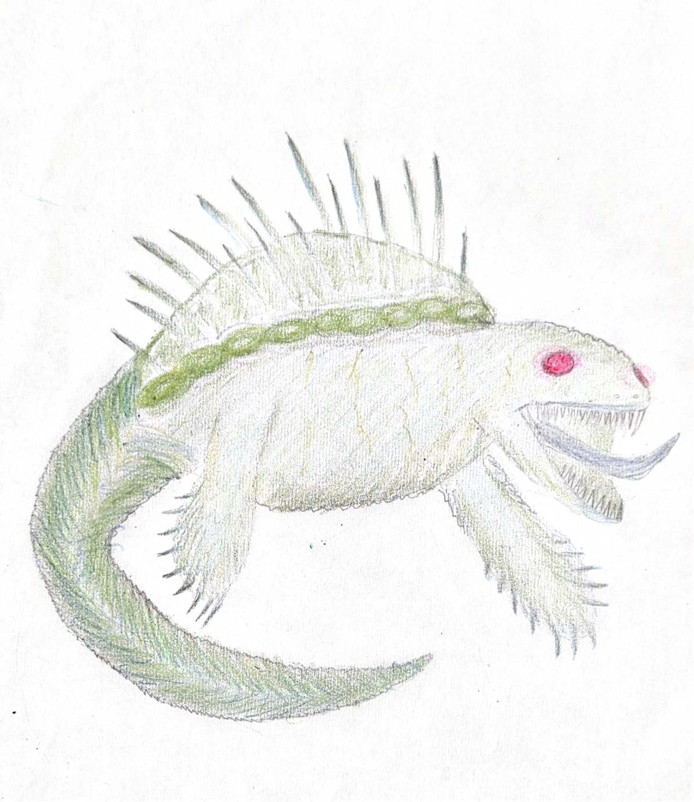

## Coastal Crisis
### RINOALK MAP

### Mission 1: Survive the Storm Ahead

_Location: Rinoalkian Coast_

_Description:_
    A powerful storm, worsened by climate variabilities in the area, has hit Rinoalk at the brink of night. The players must rescue stranded survivors from a longened voyage and secure vital supplies before the next wave of storms arrives. As they navigate through flooded streets and dangerous coastline, they’ll face environmental hazards, storm-damaged structures, and potentially hostile creatures. They must also decide whether to prioritize saving vital resources or battling the hostile creatures. 

Objectives:
- Rescue 1 survivor from a boat wreckage near the coast. 
- Retrieve essential supplies from the farmlands.
- Suffer 0 casualties from hostile creatures

_Encountered Characters:_

- **Storm Victim (NPC)**: A local survivor trapped in the boat wreckage, pleading for help.  
  - *Stats:* *(not provided)*

- **Hostile Creature (Turtius) NPC**:  
  A hostile creature or group of them looking to take advantage of the disaster for a nice meal.  
  - *Stats:*  
**Turtius**  
  - **W**: 14  
  - **Harm**: 3  
  - **K**: -2  
  - **I**: -2  
  - **S**: +4  
  - **A**: +2  
  - **P**: -4  
  - **H**: +7

- **Weather (Mild)**: Nature’s wrath, controlled by the storm as of now.  
  - *Stats:* *(not provided)*

