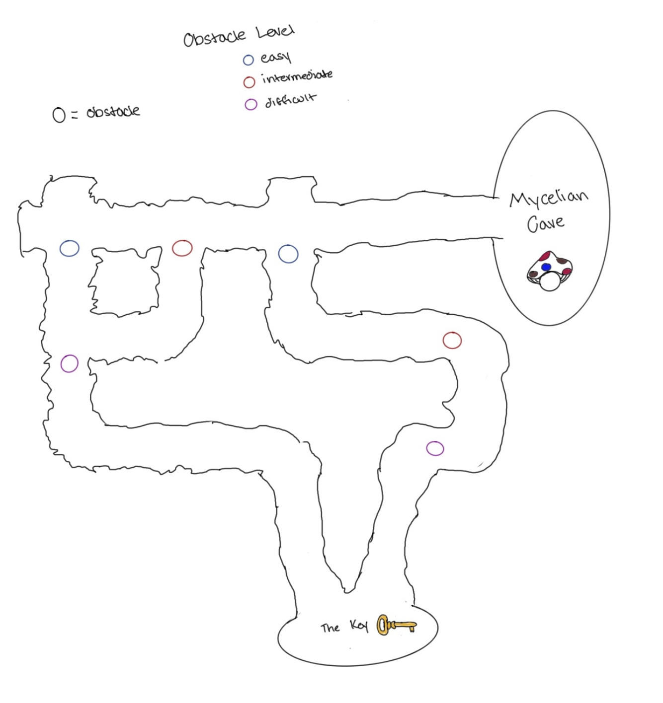

## Story Setup:  
Your party discovers the cave of a self-reliant unsocial society of small, delicate, magically inclined mushrooms who are constantly striving to amplify their telepathic connections with each other and their environment. The party is met with the ambassador of this community, Fun Gus– a closed off fellow who urges the party to depart if they are unable to offer knowledge or assistance in enhancing the Mycelian community. It is widely known amongst Sylvangrove that the Mycelians' connections to each other rely on two major pathways that they’ve developed in the world: a tree known as the Great Toad and the great waterfall, Bridalveil Falls. Fun Gus, sensing your party's non-threatening aura and genuinity allows you time to convince them that what you have to offer will fulfill the missing piece to the Mycelians home cave. Only then, will the Mycelians consider joining forces to restore the Ecotopia.

---
## Task 1: Convince Fun Gus
The Mycelians seem to be an indifferent community. Noticing the dynamic and the role Fun Gus has within the community, it seems like the only way to gain their support is convincing Fun Gus to join your cause. Their argument seems sound. They’re self-reliant, peaceful and the furthest away from the conflict. Why would they care? You try to use your charisma and reasoning to convince him. Once you convince him, your party has the support of the entire species. Try to leverage the benefit you add to their community. They have two pathways, maybe building a third pathway for them would be helpful…

**GM:**

## Task 2: Travel to the Mush Room
As your party has proven worthy to Fun Gus, you must venture on a quest to find the key part needed to install the third pathway generating system into the Mycelian cave. The journey is set through a cave system consumed with chasmic tunnels that lead to the key site. This difficult adventure is meant to be a trek that tests the party's problem-solving abilities and quick application of skills. 

GM feel free to come up with your own hurdles, but here are some suggestions:
- Eroded rock blocking off tunnels  
- Lack of light source 
- Fine grained sediments (quicksand-like)
- Loss of Mycelian magical connection (the deeper the tunnel runs, the weaker the magic)
