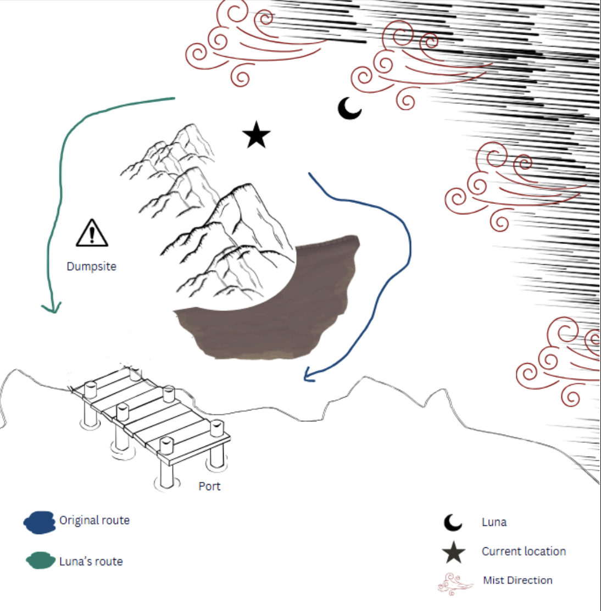

## HARBORING HORRORS
---

The salty winds of the seas help disguise the smell of the floating trash heaps Wanderers call the Wastelands. While it’s hardly a place anyone would want to live, these Wastelands are ideal places for scavengers to find any and all old world tech they could need. Your party is part of a newly formed Wandering family, and this is your party's first mission together. Extending from the soilless island is a makeshift dock hobbled together with scrap metal and seaweeds. 

At the helm of your ship, a cabin cruiser, is an old tattooed man. He’s quite gaunt, and what little hair he has left is thin and long. The man named Skipper is one of the elders of your new family, and he pulls you all together just before docking. 

“Aye lads, tighten up we’ll be docking shortly. We need dive suits so we can start doing deep sea expeditions. Scavenging on the wastelands works, but the real treasures are down below. Don go tryna become legends on day zero lookin for skiff hulls and fancy ‘Tier tech. I ain’t looking to go back with half the family we left with ya? However many of you that can’t breathe underwater will be needing one, and it would be best to try and find an extra for spare. Find what ya can, and be back. If my charts are accurate, this here oughta be a fresh dock, so there should be treasures a plenty if any of ya’s are a wee bit capable. Oh, and never forget. Stay. Out. Of. Da. mist.”

---

Skipper parks the ship and says he’ll wait for the party to return. This is where the party will eventually meet Luna, the first infected NPC, after they explore the Wastes for dive suits. The party is now free to explore out in the Wastes. In the distance from the dock, the players can make out three structures. There’s a large tower, a large cylindrical building, and a curved structure sticking out of some trash with a flag just barely visible. 

With an Awareness DC 12 check, the party can recognize the tower is a natural gravitational anomaly formation and there will be a greater concentration of gear there. Anyone of the Wanderer species will recognize the cylindrical hut as a standing site. A Deduction DC 14 will inform a player that the curved structure is an old wrecked Frontier cargo ship. If they can’t discern what the structures are from afar, they will discover this information once they get to the location.

The players will pursue one area at a time. Once they decide on a location to explore, the GM will roll D6 to see which location mist rolls in on.

| Roll       | Mist Covers        |
|------------|--------------------|
| 1–3        | The Shipwreck      |
| 4–5        | The Standing Site  |
| 6          | The Trash Heap     |

If the mist rolls in on another location, the GM doesn’t tell the party anything. If the mist rolls in on their location, they party can still choose to explore but they’ll have to deal with the mist. They can go to another location instead, but the GM will roll again for the mist. **See mist mechanic information for details**

After going to a location, the party can choose to head back to the port if they’re satisfied or explore another location. Traveling between locations uses time which allows the possibility of more mist to roll in as they are travelling on foot. The mist stays in a location once it possesses it. Players can only start recovering their sanity in locations without mist (i.e their sanity won’t restore while traveling).

<h3 style={{ color: '#8B0000' }}>The Shipwreck</h3>

Here the players find a section of a capsized Frontier cargo ship.

Any party member can make a foraging DC 12 to identify an open container containing the dive suits they need. They can see it is near the top of the shipwreck, and will require significant effort to get there. 

There’s a precarious path of cargo nets and pipes that seem safe enough to try and climb one’s way up to the cargo container. There’s also lots of rope and scrap metal around, and a good enough engineer may be able to scrape together a single-use grapple to try and pull one of the suits down, as they are exposed. An extremely talented marksman could also try and use a different projectile to knock it down, but this could also damage the suits. 

Each party member can make either a Climbing DC 12, a Mechanics DC 12 check, or a shooting DC 12 threshold check to try and acquire a diving suit. Critical failing the climb results in the player falling, taking harm and ruining the climbing path. Critical failing the mechanics check results in the container door becoming closed, making future checks +2 harder. Critical failing the shooting check results in the suits being damaged, removing its health bonus.

- The diving suits they find here are very high quality. They are lined with extra-radiation proof armor plates, giving them a +2 to their harm thresholds when wearing them in water

Aside from the diving suits, the party can also investigate the shipwreck with a Vehicles check. If they surpass a DC 14 they can find a working ship navigation matrix, a very valuable commodity to any Wandering trader. Above a DC 10 they can find less valuable ship parts they can later trade with Wandering traders. There is only one Nav unit to find, but each player who rolls above a 10 finds 2 lesser ship parts.

<h3 style={{ color: '#8B0000' }}>The Junkyard (A standing site): </h3>

**If the mist has arrived at this location**, the party instead finds it’s been abandoned, seemingly in a hurry as warm plates of food are still set out on tables. The merchant and their wares isn’t behind the counter anymore and instead there’s a sign that says he’ll return when the mist recedes. With an awareness roll of 15 the party can find 3 lesser ship parts lying around on tables of abandoned card games.

**If the fog hasn’t arrived yet, the following occurs**

---

A simply constructed hut made from the steel scrap littered across the Wasteland, its humble appearance has not deterred the many occupants from finding refuge in its walls. All kinds of species are sitting at tables drinking and playing cards, and standing behind a fenced off counter is a **Wandering Trader**.

> “What are ya buying?”

---

Talking with the merchant the party finds that they have a set of standard Wandering dive suits, and they'll trade them the full set to the party for 10 lesser ship parts. 
If a Charm check of 12 is passed they’ll also offer the party information about the surrounding areas:
- At The Shipwreck, they’ll likely find high quality dive suits, but they’ll be difficult to reach. They can also find ship parts fairly easily at the wreck. The merchant also mentions that if they can find anything special at the ship wreck, they’ll trade them a special harpoon gun. **If the party has already been to the shipwreck, they can give them the Nav unit, or they can try and pass a 14 barter check to trade for the harpoon gun with 10 lesser ship parts instead** 
  - **The harpoon gun is a sleek, ivory weapon with engravings of whales, giant squids, and old ships. It seems centuries old, but shows very little signs of deterioration. The harpoon gun does 2 harm.**
- At **The Trash Heap** the party can probably find anything they're looking for but it will likely be damaged from being swept up in the magneto-gravitational currents. They can also likely find lesser ship parts there if they look closely.

If the party already has dive suits, they can trade their lesser ship parts 1-1 for medpacks. 

The dive suits the merchant sells have no special attributes.

OPTIONAL: Assuming there’s no mist and the bar is occupied the party can gamble any ship parts they have with some of the occupants of the bar. The GM can choose any dice game and give payouts proportionally. A simple game is dice roulette:

The player picks either evens/odds, 2 numbers, or a single number to place their bet on for a D6 dice roll. If their bet hits, the payout is 2x, 3x, or 6x respectively.

<h3 style={{ color: '#8B0000' }}>The Trash Heap: </h3>

The party arrives at a heaping stalagmite of waste. With a base about 50 feet in diameter, and nearly 100 feet tall, the pillar towers over everything around it. Surrounding the behemoth are countless smaller stalagmites standing no more than 6ft tall, some of which seem to have been broken up by other scavengers searching for supplies.

The party can search the area for dive suits and other supplies. Each player can roll an Awareness check for how many searchable trash stalagmites they can find. 

Results:  
`<7`: They can’t find anything  
`7–10`: They find 1 with 2 lesser ship parts  
`11–14`: They find 2 lesser ship parts and a slightly damaged dive suit  
`15+`: They find 4 lesser ship parts and a slightly damaged dive suit  
`Nat 20`: They find 4 lesser ship parts and a standard quality dive suit

<u><strong>The damaged quality dive suit is tight where you want it to lose, and has holes where you want protection. The player suffers -1 agility and no harm soaking while wearing these dive suits.</strong></u>

The party can continue going back and forth between locations as long as they wish and as long as their sanity remains. <u>It’s okay for the party to leave before each member has a dive suit.</u>
**ON THE WAY BACK TO THE PORT TO MEET WITH SKIPPER**, the mists begin rolling in behind. About half way back, Players hear someone yelling for help in the distance. 

---

  “Help! Please! I–I know when the mists are coming. Whoever is out there, you’ll be caught if you continue to the ports this way. Please help me and I’ll get you out safely!”
  
  You see a young woman leaning up against some rubble, a large harpoon made out of bone set beside her. She’s covering her left arm with her other hand. Her leg seems injured, the trousers of her overalls cut up and made into a makeshift tourniquet. You see just the edges of a large gash. A trail in the dirt behind her signifies that she’s been dragging herself with her weapon for a while. Her face is filled with exhaustion before she spots you and is now replaced with excitement and hope. 

  “Oh, good.” She says relieved, but still wary as she shrinks back with her arm. It’s hard to tell what happened with that injury. “Please–you have to help me. I’ve been yelling for so long. You have to take me back to the port. I need to see the Doctor.”

---

If the players make an Awareness check (DC 14) to examine her from a distance, they see a glint in her injured arm, but see no blood or liquid that could cause the sheen. 

  

    <h3 style={{ marginTop: 0 }}><strong style={{ color: 'darkred' }}>LUNA</strong></h3>

    
<strong>Female Wanderer Buccaneer</strong> 
    She looks strong but her left arm and right leg are injured.

    
<strong>Knowledge</strong> 2, <strong>Intuition</strong> 1, <strong>Strength</strong> 4, <strong>Agility</strong> 3, <strong>Personality</strong> 2, <strong>Health</strong> 3

    
<strong>Weapon</strong>: Wastehowl bone Harpoon (+1 Harm)

    <h4>INFECTION STAGE 5</h4>
    
+1 Harm modifier on unarmed attack

    
<strong>Symptoms:</strong> Bloody cough, osteonecrosis, fragile bones, bone soldering, metallization of arm bones

    <ul>
      <li>In a fight, Luna would strangely attack more with her injured left hand. If players ask the GM or observe the calluses on her hands or the placement of her equipment, they will realize that she is not left-handed.</li>
      <li>After losing half of her HP, Luna will surrender voluntarily to the players.</li>
    </ul>
  

  

     
  

The injured woman is Luna, a 24 year old female who is severely wounded. She has been traveling for a long while with these injuries and looks like she would travel even more–if she could. Luna belongs to a Wayfaring group that tends to work individually but gathers together at The Ark during breaks or when something goes wrong. Her ship’s name is The Farlong and they mainly work to supply The Ark through fishing and redistributing food at drop off points. Her Buccaneer expertise tree will max out on Fishing first, then Piracy. The Farlong has skiffs to deploy for them to do individual work. Though she usually feels skeptical around strangers, if she doesn’t get help here, she will die. Players might not feel the urge to help or try to leave. Luna will convince them to help if they ask why they should–if they don’t ask, she will try to convince them anyway.

If the party is full of Outsiders, seeing that the players don’t belong in the wasteland, Luna will convince them that she will promise to be their guide around the edges as long as they take her back to the port in return. If any of the players is a Wanderer, Luna will promise that she will hand over an extra 10% of her scavenging haul back to her ship and that they will have the loyalty of her Wandering crew. Luna is loyal to her Wandering family and will act very wary if a player asks too much about it. She will not answer questions about The Ark or anything else, and will only mention Farlong as her ship and that she and her crew are Wayfarers that fish.

If Luna is healed in any way:
- If players try traditional medical treatments, her wound is healing strangely slowly, as if medicine has a weaker effect on her
- If players try magic healing, her wound is healed but the bone is fused where it is still sticking out. Due to her gratitude to the players, Luna will voluntarily confess her symptoms if the player has not discovered it by the end of this encounter.
- If the players choose to talk to Luna she will reveal the following information:
- “I met a Wastehowl while looking for supplies. The injury to my arm was sustained while fighting it. It tore a chunk of it open…I think it bit through my bone. Or at least, it sounded like it.”
- “My leg injury was from its claws, and it still seems to be bleeding out. I’ve been using my weapon as some sort of crutch, but I can’t risk doing that any more than I already have.”
- “It was obviously painful when I was struck down–it lunged at me and swiped at me as I managed to shoot at it to get away…gun blew up though, hence the singed fingertips. Everything’s still numb, surprisingly, doesn’t hurt as much as it usually would–but, maybe I’m still in that adrenaline dump–you know, I’m very glad you found me. So, all that matters is getting me out of here.” (Make players roll an Insight check DC 10. They realize that what she said made her nervous. She slipped up and is now trying to distract the characters from what she just said.)

From this point on, pressing Luna about her injuries will need an Insight or Charm check DC 14. If players succeed on the check, Luna will proceed to show the characters her wound. Her bone has fractured, with one jutting out near her elbow. It looks mottled and rotten at the joints. (If a character has a sanity status effect, they lose sanity by 5% by seeing this.) At first, it seems like an infection, but at a closer look it looks like a mutation. Players know that species like Avenari or Moby have come from unnatural mutations from pollution and radiation, and that Wanderers have worked hard to avoid it and keep their human forms. Wanderers often get sick from the Wastelands, and radiation sickness often causes odd symptoms and strange mutative effects:

---

But not like this. You have never seen anything like this. The bone texture is rough, meshing with sinew and meat, as if it were decomposing or gnawed on by a million tiny bugs. It’s cracked in multiple places, amassing into one compound fracture. The issue is the small synaptic bridges of coated metallic material like soldering that are bringing the broken pieces together, not fully following the shape of the bone but also wrapping around it. Mutation is caused throughout years and genetic changes–a child with a third ear, another with a set of missing ribs–or small changes like a slight odd coloring of skin–not grotesque or instantaneous like this.

---

Luna will offer the following info after players have succeeded for Charm or Insight:

- After a while, she suddenly realized that the bone had started to become sewn together by some sort of metal. The glint that was suspected to maybe be blood earlier was actually Luna’s bone. 
- Luna has no idea about the reason for this transformation and is scared so she wants to go back to the port to see the doctor. She doesn’t feel the pain of the broken bone, but she should. She looks shaken up by this.
- She had fought wastehowls many times before, and not once had her wounds mutated after an injury.
If players make a check to know more about the doctor that she is talking about, they need to make a relevant type of Knowledge check with a +2 bonus for Wanderers. Any character affiliated with the Ark would know this information:
- The Doctor is the most knowledgeable medical person in the wasteland. If anyone could know how to deal with this situation it would be them.
Regardless of how much information the group has gotten out of Luna, the mists will quickly roll in one round away from them. The timing of this is up to the GM’s discretion, but must try to give the pressure of time. The woman hides her injury away from the eyes of the party again as she grabs her harpoon. She will ask one of the players to help her walk before pointing down the direction they were headed before.

---

“Y’all’re heading down towards that way, but the mist is cascading in from the East. If we go down the path to the right, that mountain of rubble will help shield us from it. Unfortunately, that Dumpsite’s populated by Wastehowls. So, it’s safe from the mist, but it’s only a quicker route if you know how to deal with ‘em bastards. Which, I would say I’m an expert at…until what happened earlier. Though, what removes my flesh doesn’t remove my knowledge. I’ll help us move through as best I can if you can keep me up and protected.”

---

>Show players the map. If needed, a successful Awareness check of DC 9 shows that Luna is telling the truth. The safest path is through the dumping grounds as the mists would either dissipate upon reaching the mountain area, or at least take longer to travel to the party. Players who might have encountered these creatures before would know that they squeal before they attack and attack in packs, but are relatively weak if you don’t get caught by surprise

<h3 style={{ color: '#8B0000', textDecoration: 'underline' }}>
  DUMPING GROUNDS:
</h3>

---

You make your way scrambling down the sides of the garbage infused hills. Scrap metal and old-world electronics stick out like rocks that your party hops between while making their descent. Around you in the distance you can hear the howls of hungry beasts, and all around you there are small openings that would make for ideal animal dens. After what feels like hours of careful maneuvering, your party reaches a valley it seems should lead you out of the canyons and to the docks. As you finally reach level ground, Luna pulls off to the side to catch her breath. There’s a slightly unnatural wheeze in her breath, a rattling that sounds closer to what you’ve heard in rustling pipes than on a sick person's breath. Before she has a moment to recover, she jerks up, and asks ‘Do you hear that…?’

---

Players can make a DC 10 Insight check. If they pass, they will recognize that Luna must be talking about an incoming threat, which will allow 1 action round before combat. The creatures are not in sight yet, so there is nothing to attack yet.

A group of 4 wastehowls emerge from the trash surrounding the players. On Luna’s turn, she will try to attack one of the wastehowls with her harpoon. Regardless if her attack is successful, she will fall to the ground, overcome by the effort exerted to attack. She will no longer be able to take actions in this combat.

<h3 style={{ color: '#8B0000' }}>STAT BLOCK:</h3> 
Wastehowl: Agility = 5, health = 3, damage = 1

They always act in swarm of 3 or 4, they always take actions first. Can move up to 25 feet each turn

As players exit the Dumpsite, Luna looks worse for wear after the encounter with the Wastehowls but commends the characters for putting up a good fight. They catch their breath for only a moment.

As players see the Port up ahead, describe this scene:
---

 You see the panicked scene of Wanderers packing up the port. A large wooden signpost, with streaky and dripped white paint: PORT 103688, is in danger of being blown away from its anchorpoint. The mist howls in the distance once again. The players see Wayfarers running to their scavenger ships with materials in hand, some spilling rusted cogs or dented cans. They see merchants struggling to pack up their wares, with some mischievous Wayfarers snatching some on their way to escape. Ships begin to raise their anchors or board their windows. 

Suddenly, someone yells, “Maintenance is here!” you see everyone else repeat it back: “Maintenance is here!” as if it were a call and response. Something breaks the mist in the sea–an incomprehensibly large ship with masses of Wanderers on board and Wayfarers piloting out emergency skiffs ahead of the ship.

“The Ark!” Luna yells over the whipping wind. “We’ll be safe there–and we’ll find healing enough for all of us.”

---

<h3 style={{ color: '#8B0000' }}>PORT 103688:</h3> 

Players can make checks to have a closer look or listen around the port, or to know more about Maintenance or The Ark, especially if they are not Wanderers. The GM should encourage players to think about their options and play to their characters– whether that be trying to pilfer dropped goods, steal from open shops, or helping NPCS leave–by describing things from the NPC table below. They can choose to run straight to the end of the port and await The Ark. Ask players what they wish to do. During this round, The Ark will arrive and so will Turtius.

---

A large slimy tail breaks through the boards of the port, stopping you in your tracks or conversations. A creature with the body of an eel and the limbs of a turtle emerges on the coast. Giant clams and stingrays also approach, with the clams making their way onto the land. This port is large enough that these monsters merely swarm the edges, leaving you enough space to make it to The Ark without having to enter combat with them. There are more of these creatures rushing in as this ginormous red-eyed beast continues to rampage on abandoned ships and shops. Luckily, most Wayfarers have left the port’s edges, though they are encountering difficulties entering their ships due to the now unsteady waters and lurking Stingrays.
You may not be in danger, but taking actions to help your Wandering kin might help you, and help them survive. You think you can take on the clams at the port and stingrays at the waters, but you know you won’t be able to land a scratch on the beast whose maw is the size of one human.

---

Have players roll initiative. **Three swarms of ranger clams** and **two stingrays** threaten escaping Wayfarers. Players can choose to engage in combat with these monsters, but will know that they can only keep them at bay as more swarms approach. They will not be able to kill Turtius as there is no time and they are too weak. With each round, these monsters will destroy more, kill more, and get closer. The mist is still closing in. The Ark is beginning to take people and ships onboard.

If you wish to take an encounter or roll an encounter for your players, or to describe what may be happening at the port, here is a table of suggested NPCs around:

<h3 style={{ color: '#8B0000' }}>RANDOM NPC ENCOUNTER TABLE (d6)</h3> 

| Roll | Encounter |
|------|-----------|
| 1 | A wayfarer dropping canned water and some metal scraps that players can take an action to pick up. |
| 2 | A merchant hurriedly packing up goods. This merchant is an Ark citizen who will give players that help him one free item at his shop later. |
| 3 | A merchant trying to stop clams from stealing her fish. She’s playing tug of war with a clam as another one is approaching her, ready to attack. |
| 4 | A wayfarer hauling a huge sack of healing packs and weapons, slowed down by it. |
| 5 | A buccaneer on a ship is shooting at a stingray who is attacking a young wayfarer who looks to be about 16. |
| 6 | A merchant is running on board his ship, taking off and leaving his shop anchored with all its wares (*roll merchant shop table*). |

**Movement.** There are **five** rounds until the mist catches up to players. They can choose to do something other than run, which will cost them their movement if they fail the corresponding check. But with risk also comes reward. Players can do an action and movement per round–if players move three times, they make it to The Ark. Players can try to risk it and make it to The Ark in less than three rounds of movement, but it is up to the DMs discretion what checks they need to make or what consequences happen. Players can choose to dash straight for The Ark.

**COMBAT**
<h3 style={{ color: '#8B0000' }}>STAT BLOCK</h3> 

Ranger Clams: Health - 7, Agility - 3, roll d6 to determine swarm size. Clams the size of medium size dogs that shoot out pearls in a gunish way. Attacks range from 1-3 harm, have really far attack range but further away attacks decrease the damage of the attack. Very agile and would retreat upon being approached.
- 1-2: one clam
- 3-4: two clams
- 5-6: three clams
Stingray: Health - 6, Agility 3, Attack Range 1-3, Poisons on hit. 

A stingray that has mutated to have multiple stingers.

Turtius: Health - 14, Agility 2, Attack Range 3-6. 

**Players that choose and are successful at combat can gain**

- Rapport: if a non-merchant NPC from The Ark is saved, they are grateful, promising to help the party with any one favor as they run to the ship. Players can choose to use this favor at any one time during the campaign–only once. If a merchant is saved from combat, check the NPC table above for reward.
- Knowledge: looking up close, these monsters are native to Karkorte. Characters don’t think that they should be at the Edge for any reason.
- 1 XP, pearls, and clam meat upon defeating a Ranger Clam.
- 5 XP upon defeating a Stingray.

**Players that fail at killing these monsters or abandon combat will mean that NPCs will get hurt**

Ignoring the monsters, players can still have time to rescue, help, and take items (from stalls left behind, packing up, or from what people have dropped) that are not close to the monsters. If they fail their task during a round, they are unable to take movement toward The Ark. Each task will require a skill check.

**STEALING FROM SHOPS (Thievery Check)**
- **Reward**: Pick a reward from a random merchant table, amount or quality of reward varies with how successful the roll was
- **Consequence for failing the check**: Skip movement this turn as a clam ranger takes a shot at you. (Roll an attack for a clam ranger against this player. Players cannot retaliate.) This may damage rapport with merchants. GM’s discretion if this would cause inflation of prices for certain shops.

**PICKING UP DROPPED ITEMS**
 - **Reward:** Food rations (1-3), canned water, Frontier-Cola, scrap (1-3)
GM rolls a D6 to determine how many items a player manages to get and which items they pick up. For example, if a 3 is rolled, the GM can decide that the player will get food rations (2) and scrap (1).
**Consequence for failing the check:** Player is distracted and loses a movement this turn.

**HELPING NPCs ESCAPE OUTSIDE OF COMBAT**
- **Reward.** A specialty item from merchants, a coin pouch containing 25c from non-merchants.
- **Consequence for failing the check:** NPCs might not make it to their ships on time, player is unable to take a movement for that turn. 

<h3 style={{ color: '#8B0000' }}>THE ARK’S DECK (BOW-SIDE): </h3> 
Narrowly escaping, the party successfully makes it off the makeshift pier and makes their way to The Ark. 

---

	When you get on this behemoth of a ship, you see a sort of organized chaos. On the deck you see maybe around a hundred people. Most are Wanderers, some children peering over the ledges to catch the action and adults whisking them away to safer areas, some are Wayfarers cashing in their hauls with the ship’s crew, some are just civilians helping crew and Wayfarers with the current emergency. The Ark pulls away with a blast of its powerful engine, leaving the view of a collapsing port behind. The threat is gone. 

You can tell they regularly receive people in this area of the deck, with tents around for food rations, merchant stalls set about, and a large sickbay receiving patients–some hurt from the recent escape. There is another small lodging area separated out for Outsiders. Though it seems they are treated well, not many Wanderers who look to be more permanent residents of The Ark seem to mingle with them. 

	The Ark is massive, with the most individuals you’ve seen gathered at one spot. They share stories. They exchange maps and discoveries. You see a large central building where you assume these people live. “The Ark’s Core”, Luna will mention as she sees you staring at it. “Welcome aboard. Now–” she coughs, “I think one of us at least needs to see The Doctor. I’ll wait by the sick bay, come get me when you’re ready.”

---

With an Insight or Awareness Check of DC 10, players will notice that there seems to be a small line forming outside of the outside clinic. The tent is large, meaning that they must be seeing a lot of patients. A few people are coughing, one or two with casts on their limbs. Illnesses happen often with the poor living conditions and constant struggle of survival. Players who are more insightful or aware might notice that there is a little bit more than the expected amount of patients.

The characters are free to speak to whoever and check out the merchants on the ship. Luna will wait on a bench as she is checked-in by a nurse, but she hides her strange injury, seemingly waiting for this “Doctor” to get it checked. 

If they speak to Wanderers or Outsiders, they will give a general rundown of some things about The Ark.

- For Outsiders, they might be dropping off shipments or discussing resources or information with the council of the Ark, Maintenance. They might have differing views of Wandering culture. That they’re too closed off and judgemental, or that they do what they need to to protect themselves.
- For Wanderers, they’ll speak on life aboard the ship. Seems pretty easy going, with Wayfarers contracted by Maintenance or others to gather artifacts or supplies. They will answer questions about Maintenance, such as who the 10 councilmembers are and what they are in charge of [See NPC list]
- Some might be loyal to Maintenance, some might not, some might just be there until the next port. They’ll have varying opinions on The Captain’s goals, but most will agree that they’re happy to know more about human history.
- Some Wayfarers might have stories about the mist.

If they speak to patients.
- “I’ve had this nasty cough for a while. Coughing up blood and allat. Air’s getting harder and harder to breathe. That’s why The Ark is so important, they’re trying to help the air quality or figure out how ta, but I sure wish it could happen quick.
- “My son got sick the other day. Children have weak immune systems. I just thought he’d be safer on board The Ark rather than out and about…well, it’s about the season to get sick. Hope I don’t catch anything too.”
- “I broke my ankle trying to fix something aboard the ship. I’m one of the crew for the Janitor. I was checking the pipes in the ceiling for one of the residential units. Fell off the step ladder, heard a big crack.”
There is a merchant list under **NPCs** if players wish to trade or shop around. Players may use their rapport here from the previous encounter, but they **cannot get a new diving suit as production has halted and they’ve been hard to come by fully functional.**

Once players come back to Luna, she will ask them to take her directly to The Doctor to speed up the process of her getting checked.

In the sickbay, we see a receptionist checking in patients and calling them to be seen. There are multiple doctors running about and multiple nurses going around to give patients numbers for those further down the waiting list and giving minor treatment when possible. 

---

The receptionist looks up at your party with a raised eyebrow, “Do you have an appointment? If not, we need you to get in line with everyone else and we’ll try to get to you as best we can. With the recent influx from the port, we have a lot of patients at the moment.”

---

If players mention that they are looking for a doctor:
- “We have a few working shift today, which one?”

If the players mention The Doctor
- “The Doctor? He usually oversees the more severe cases. You lot might look roughed up, but not that bad [if players are injured]/ You lot look fine [if players are not injured.]”
Once players mention Luna’s condition:
- “He’s down the hall, first door to the left. He’s on break, so he should be available. I doubt he’s even taking a break, though. Busy guy, always out and about with patients and checking files. Just let him know that Magnolia sent you.” Her nametag says ‘Magnolia.’

---

As you arrive in the Doctor’s office, you see a lanky man with glasses underneath a tubed gas mask and a white coat scurrying around between various patients and experiments running on his desk. Approaching him, he seems quick to dismiss you. He will not respond until the party mentions Magnolia, after which he replies:
“Take a seat on the open table, and I’ll be with you in precisely 1 minute and 23 seconds.” 

---

  

  

    
<strong>Any protesting from the party is ignored,</strong> he continues what he’s doing without any acknowledgement. If they try to physically interrupt him he will protest saying “IF you continue to prevent my work it will only take longer until I am able to help you. Sit. Down.”

    
<em>The Doctor will be surprised by Luna’s wounds–though, pleasantly surprised. His goal of spreading his virus–Chromagenesis–has reached its very first stages. The Doctor will be bluffing throughout this conversation, but he will have an impossible DC against Insight or Deception checks with low-level players, with a roll of 18+ only sparing the players a few pieces of information that barely reveals much. He knows that sooner or later, this will get the attention of The Captain and the council will have a meeting about Luna’s condition regardless. He will send the party to meet the high council, consisting of ranks 1-5 of Maintenance in order to offload the suspicion on himself, acting as the good samaritan notifying the rest of Maintenance about this mutation. The Doctor is incredibly intelligent and cannot be fooled by the party at this level. The only other information The Doctor will offer is his ‘treatment’ plan for Luna–to keep her for examination as he tries to run down a differential diagnosis of her symptoms, giving her medicine for the pain and trying to set the bone back in place. Though, this is all only to seem kinder than he actually is. He wants to push her further, deeper into the stages of infection.</em>

  

---

He’s calm and methodical when working, and as promised he walks over after the exact amount of time he claimed. “Alright, I have precisely 4 minutes and 34 seconds to get your information. I assure you whatever ails you I will be able to identify it, but only if you are honest and succinct with answers. Tell me what is wrong.” As he continues, he begins unwrapping the bandage on Luna’s arm. The wound looks worse than what you’ve seen before. The metallic seams are expanding. The broken bone has been reformed, but appears to be solid metal. The flesh around the wound is chalky and developing a bronze tinge. The veins flowing through her arms have become pronounced and have turned black. This to be explained by the blood surrounding the gash which is thinner and darker, resembling oil. 

	The doctor's focus is temporarily disrupted when unwraps the bandage, but it quickly returns. [An insight check DC 15 tells the players that there’s a sense of satisfaction in his face.]

“Ahhh, this is new. Forget what I said, you will need far more of my attention than originally calculated.” He turns to the party “You, all of you. One of my nurses will escort you to The Ark’s core. Only those with a resident card usually have access…but I’ve seen countless radioactive mutations in my time, this is an exception, not the rule. Whatever is happening to this poor girl is something we’ve never seen before. If this is contagious you may have been exposed. You need to go to see the high council immediately. It may take time for them to arrive, but you must wait. Talk to no one. It will cause panic if you do. Do not cause panic or I will have to diagnose you with temporary insanity.” As he finishes, he snaps his fingers as a nurse quickly escorts the party out of the sickbay tent to The Ark’s main building. 

---
