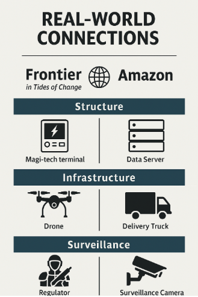

### Overview of Frontier’s Influence and Overview of Corporate Power and Monopolies

Frontier Corporation within Tides of Change is enormous compared to the typical firm–it’s an enormous economic megacorporation. Frontier dominates many places and has an influence on key networks that include water purifiers, factory foods, and access to Magi-tech terminals. Because it is omnipresent, it is an unofficial watchdog in places like the Broken Coast, Neo Cascadia, and the Glass Islands.

### Examples from the Game World
- Coerced tributes of labor or scavenging in exchange for provisions (Neo Cascadia)
- Surveillance devices like implants (through the use of the Loyalty Chip) and drones
- “Regulators”, the armed enforcement caste which overrules opposition

These are some of the ways in which Frontier enforces an economic dependence. In the Glass Islands, for example, only those citizens who abide by Frontier's laws are given clean drinking water or food rations—the rest must scavenge or go hungry.

### Real World Connections

This resonates with actual trends including: 
- Disaster capitalism: After Hurricane Katrina, for example, public services like schools and utilities were privatized, often leading to greater inequality and restricted access for vulnerable communities—similar to how Frontier controls water and food.
- Corporatist monopolies: Corporations like Amazon and Exxon operate across multiple sectors and regions, consolidating production, logistics, and even housing. This reflects how Frontier controls nearly every survival-related industry in the game.
- Surveillance capitalism: Companies like Google and Facebook collect vast behavioral data to influence users and predict decisions. Frontier’s Loyalty Chip and aerial drones mirror this same logic of data-driven control and predictive governance.

### How Players Experience This System

Frontier presents players with intricate ethical dilemmas such as:
- Do you collaborate to bring short-term stability to the community?
- Or do you rebel and face deprivation, monitoring, and exile?

### Why it Matters

They grant Tides of Change an incisive commentary on the danger of unchecked corporate fiat—making Frontier not just a faction, but an organ of systemic analysis.