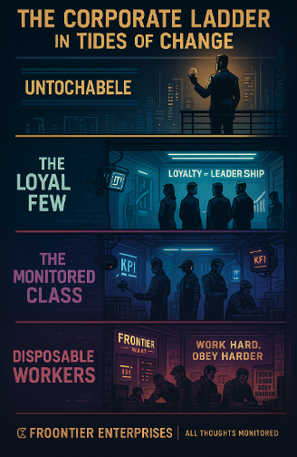

## Overview of Labor Stratification
In Tides of Change, labor is not equally valued or rewarded. Social class divisions are deeply divided under the control of Frontier, especially in the city of New Everest. Workers at the bottom face harsh living conditions, low upward mobility, and constant surveillance, while the upper class enjoys comfort and influence. Labor is not just divided by skill, it’s also enforced by technology and ideology.

## Examples from the game world:
- Workers live in employer owned housing and spend most of their incomes on Frontier products.
- Promotions rely on loyalty and connections, not merit.
- Surveillance implants like Loyalty Chip erase rebellious thoughts and force thoughts against the company.
- The Gem suit and Krystaline Bio Stimulants push laborers to overwork, and as time goes on this will affect their health.

## Real World Connections
This systems mirrors real world labor inequalities such as:
- Foxconn workers in China living in factory owned dorms and experiencing long shifts under surveillance.
- Amazon warehouse employees monitored for performance with little rest, tracked through handheld devices and AI.
- Company tones in the early 20th century U.S., where workers were paid in company scrip and forced to buy from company stores.
- The idea of “promotion by hard work” being a myth in many industries, where success is often tied to social capital or nepotism.

## How players can Experience This System
- Start in lower classes with limited access to transport or clean housing.
- Be required to follow strict routines and work quotas to survive.
- Use implants or stimulants that affect gameplay.
- Attempt to rise through the ranks, only to realize it requires bending to the system or exploiting others.

## Why It Matters
This system raises questions about fairness, freedom, and power. It forces players to reflect on real world labor divisions and how economic systems often value obedience over well being.

