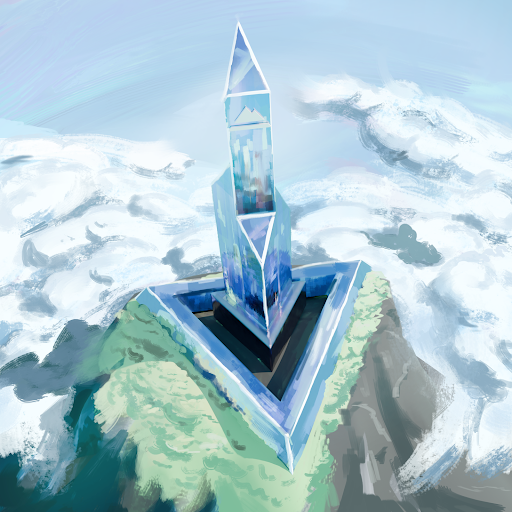
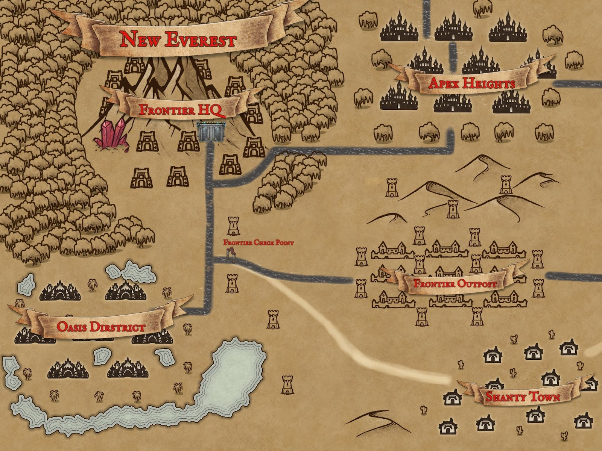
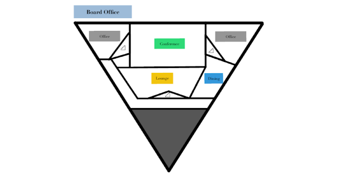
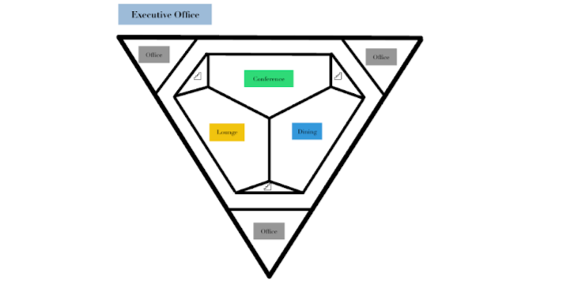
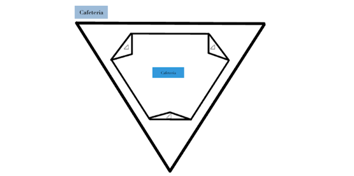
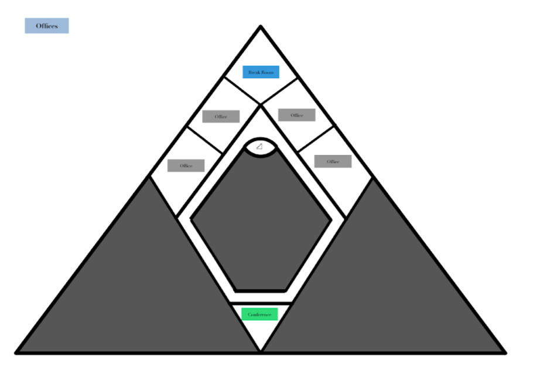

## The Seat of the MegaCorp

In a staggering feat of engineering, Frontier leveled the peak of Nanga Parbat, one of the highest mountains in the Himalayas. The company built its headquarters atop the flattened mountain. In true hubristic fashion, they dubbed the complex and town springing up around it New Everest. Despite the fact that New Everest was nearly a thousand miles away from the actual Mount Everest, it became a common misconception that Frontier had taken the highest peak in the world as their seat of power.

The city became home to multitude of mutant people seeking refuge from the chaos and political upheaval that had engulfed much of the world. Under the strict guidelines of Frontier, the city became a place of incredible stability and safety. Crime is next to non-existent, employment is always available, roads and infrastructure are immaculately maintained, and in many ways it could be argued that New Everest is one of the best places to live. For many, their professional and creative freedom is a small price to pay for the stability that Frontier offers.

For others, the enforced order of the city is stifling. Class divides are striking, and the promises of upward mobility and merit based promotion are rarely actualized. In recent years, expansionist policies have led to an influx of workers from regions affected by Frontier’s involvement in local economies around the globe. Tensions are rising, although the peace has been maintained for the moment.
>*I looked out the window of the transport station at the bustle below. It looked innocent enough. New Everest—a fairly clean, orderly place, where masses of people went about their lives; socialized, worked, slept. It was named for the hubris of its founders believing it would be the new peak of the world. The reality was much less grandiose. Like any city, citizens were divided into strata of class and wealth. That was the natural order of things, some would say. Most of us were content with what we had. We were alive, fed, clothed, entertained... what more could we want?* 
 *But look more closely, and things started to seem suspicious. Too orderly. No one ever looked out of place, as though they were somewhere they didn’t belong. The natural chaos of a crowded city was conspicuously absent. It wasn’t a living thing. It was an automaton. A vast, humming machine, not built to serve us, but to sustain itself. And us? We were just the cogs.* 
 *And that damn logo. It was everywhere. So much so that it had stopped having any meaning a long time ago. A mountain, supposedly symbolizing how we had risen above the tides that swallowed most of the world. Now, it was just another mantra, a hollow reminder that we belonged to something greater than ourselves. Or rather, that we had no choice but to belong.* 
 *I scanned my badge on the transport kiosk. The screen flashed an angry red. A sharp beep followed—two notes, clipped and final. I sighed and checked my watch. 8:58. Two minutes early. I was authorized to use the transport to the peak only during my designated hours. No exceptions. Not to arrive early, not to leave late. The machine governed movement as much as it governed thought.* 
 *I didn’t even know what purpose my job served, really. Each day, an hour-long meeting. Then, seven hours of psychological surveys for incoming employees. I went over my quota yesterday. My supervisor wasn't pleased. He hadn’t been angry, either. Just... indifferent. “You didn’t use the allotted time per employee.” That was all he’d said before filing away the surveys. I had no idea what they did with them. I didn’t care. That’s what I told myself, anyway. It didn’t matter. Nothing did.* 
 *I just had to keep my head down. Follow the routine. Do what was expected, no more and no less. I had a family to take care of. That was what was important. Keeping them safe. Keeping them fed. Making sure nothing ever gave anyone a reason to take that away from me.*

## City Planning
Seen from a certain perspective, the infrastructure of New Everest functions perfectly. Housing and resources are available at every price level, so as long as one finds stable work (which Frontier seems to have an endless supply of) they can easily provide for themselves and their own. 

New Everest itself consists of ‘clusters’. At different points in the city, major Frontier buildings form nexuses around which the population distribute themselves. The Security Compound, the Industrial Park, the Mining Elevator… Portions of the city can be divided based on proximity to the closest large-scale workstation; each such station practically runs its own satellite town.

Population tends to be denser closer to these workstations: the poor mostly live walking distance from their workplace, crammed into stuffy but livable quarters. Move a little farther out and public transport becomes a viable option for commuting from slightly more comfortable homes. Move further out—to the tips of these nexuses—and the housing conditions become positively luxurious. Perfectly maintained roads allow the wealthy tenants of these suburban homes to commute easily to and from work. 

Without private transportation, however, these spacious residences are physically unreachable. The same can be said for movement between these nexuses. Nothing connects them except extravagant highways; the terrain is too harsh to traverse on foot. In a very real sense, the poor cannot escape their stations—they live and die by their work.

Perhaps the rich and the poor can find solidarity in the fact they live in similarly vertical apartments. Wealth disparities cannot erase the reality that flat land is rare, so even New Everest’s wealthiest find themselves living in high-rise apartments (though the size and quality of these apartments vary vastly). If the richest and poorest of New Everest can bond over anything, it might be a mutual distaste for neighbors. 

In summary, New Everest consists of numerous satellite nexuses, built around large-scale workstations. Only the wealthy can move between (or even within) them, with the poorer living inexplicably and claustrophobically close to their place of work. These nexuses are scattered and separated throughout New Everest, but at the very center, at the highest point in the city, stands Frontier Headquarters.

## Frontier HQ

Most feats of engineering toe a thin line between astonishing and arrogant. Nowhere is this better seen by Frontier’s Central Headquarters.

Seated at the top of the highest mountain at the center of the city, everyone from anywhere on the island is forced to look up at the tower as it looms down on them from the highest point in the new world.

Frontier HQ is accessed through a massive lift at the heart of the mountain. As it is almost exclusively bigwigs that work in HQ, the only means to access the lift is to drive through a tunnel at the heart of the mountain. Traffic can get pretty bad in this tunnel, but priority lanes for higher-ranked employees makes the waiting times strictly hierarchical. 

Striking just shy of 100 stories tall, the HQ is the only skyscraper left not to be submerged underwater.  The interior layout generally consists of office spaces, conference rooms, break rooms, and cafeterias. Of course, higher floors consist of the higher-ups with greater access to fine dining, lounges, and spacious offices. 

Some neutral observers comment that this arrangement is wildly impractical and criminally wasteful. The resources spent on maintaining the tunnel and operating the lift may be better served elsewhere, given the apocalyptic state of the world, but Frontier understands the importance of exclusivity.

It also understands the importance of optics. For those few lower-ranked workers (guards, cleaners, gardeners) who cannot be automated but are not paid enough to commute, special arrangements are made. Underground quarters are burrowed into the top of the mountain so they can walk to work without their homes and communities ruining the view from HQ.

| Floor             | Range  | Layout |
|-------------------|--------|--------|
| Board Offices     | 96-101 | 
| Executive Offices | 91-95  | 
| Cafeteria         | 90     | 
| Middle Management | 81-89  | 
| Lower Management  | 70-80  |
| Offices           | 2-80   |