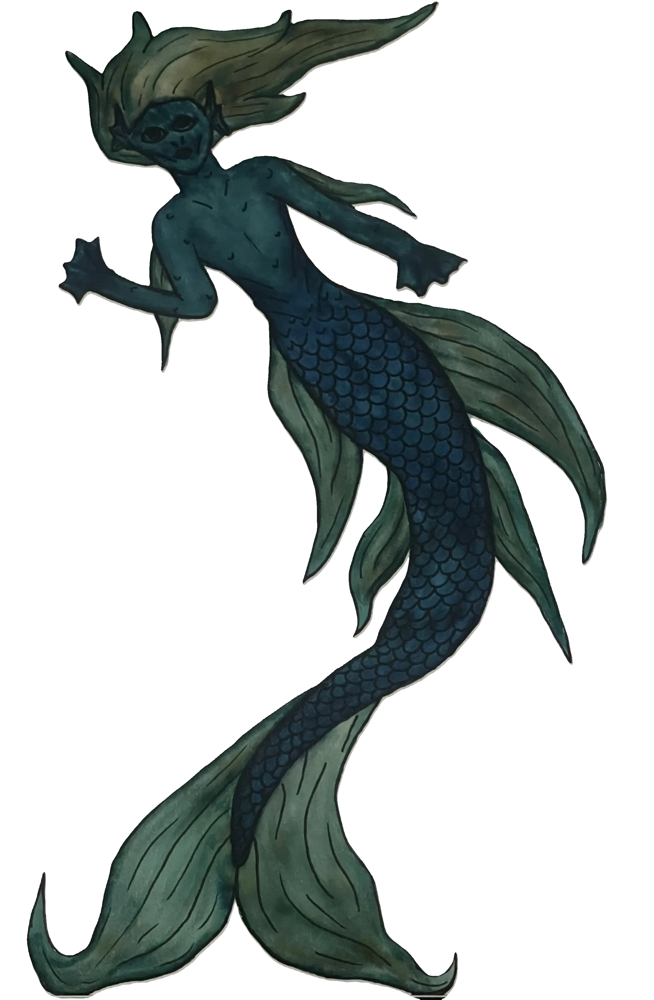

Aqualumeans are humanoids with +1 strength and range from 5-7 feet long. Featuring mermaid tails and gills on their upper body in which they can breathe underwater, they have innate physical abilities that allow them to travel rapidly and nimbly through the reefs and the currents.

## Special Abilities

They communicate telepathically with one another, but they have come to understand and speak the human language as pollution blocks their telepathy. As a species, they are generally peaceful, and prioritize life (sea-animals, aquatic plants, etc), and only hunt necessary amounts to feed their communities.

### Skills for Character Creation

-   Foraging (knowledge) - navigation
-   Sneakiness (agility) - stealth
-   Swimming (strength) - underwater combat
-   Awareness (intuition) - echolocation
-   Medicine (knowledge) - marine knowledge

## Special Weaknesses

Aqualumeans are water creatures and cannot breathe on land. When they have to move on land, Aqualumeans need a special suit that covers and protects their gills and allows them to hover over the ground (protects their tail).

## Social Hierarchy

Their communities are structured in a hunter-gatherer format, where each Aqualumean contributes to the community. Instead of a rigid hierarchical structure, they practice viewing social categories with community responsibility and respect for diversity, community, history, and nature. Their leaders are called “Celestial Dragons,” who are elders who have become more powerful due to their connection to the hidden Aqualumean ‘Lux’ reservoir. Celestial Dragons are highly respected for their wisdom and knowledge (as many of them existed long before the creation of Atlantis), and they often carry the role of teachers and guides of the other Aqualumeans. They also carry the task of protecting the Lux reservoir and have more powerful telepathic abilities. Unlike other Aqualumeans, who can only project their mental voice into one other being at a time, Celestial Dragons are able to project their voice into all Aqualumeans at once.
