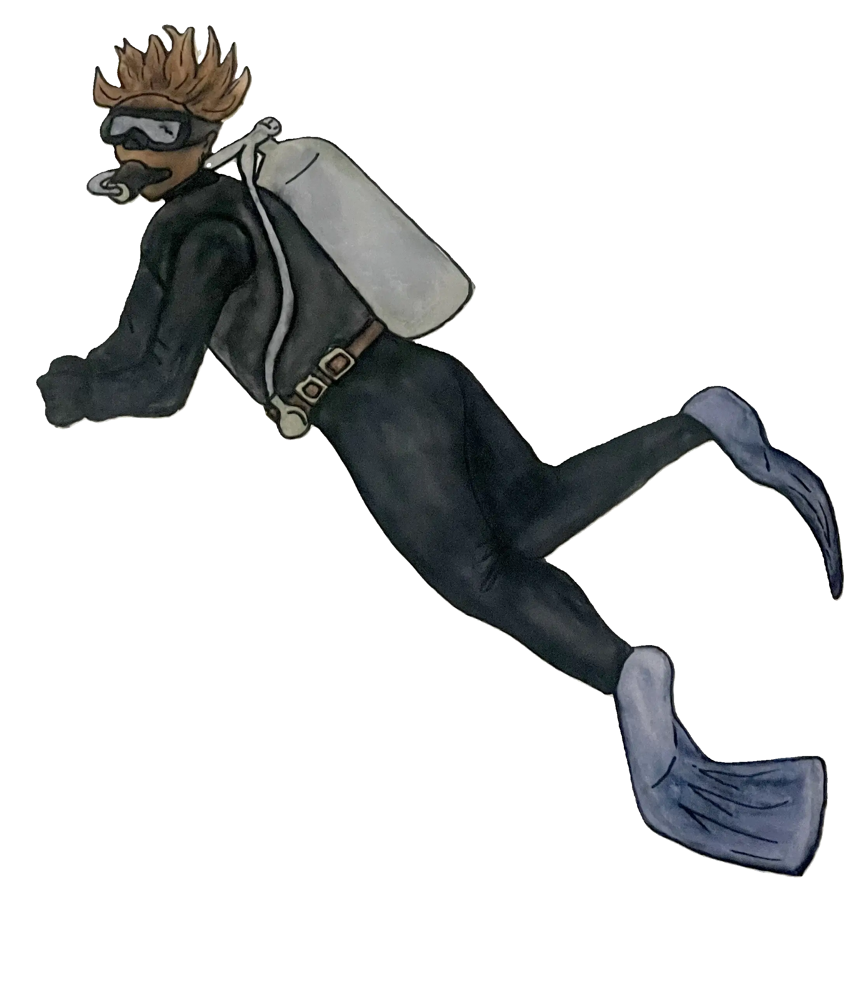

Atlanteans are humanoid creatures with knowledge +1, whose size ranges from 4-6 feet. Once residing on land, their pollution forced them to create an energy powered ecotopia in the core of the ocean known as Atlantis. Atlantis is mainly powered by utilizing Lux from Lumea as they continuously advance their technology. They are highly creative and intelligent creatures, but their self-centered nature and ignorance hinders their success and negatively affects their treatment of others in society. Because of their heavy reliance on technology, their stats decrease without technology.

## Special Abilities

Atlanteans have access to frontier technology and thus begin the game with 1 extra piece of equipment. Due to their abilities, they are able to further advance their technology and improve the quality of life in Atlantis. That is, until the supply of Lux runs out.

### Skills for Character Creation

-   Mechanics (knowledge) - engineering/crafting
-   Vehicles (knowledge) - technological navigation
-   Deception (personality) - cunningness
-   Cybernetics (knowledge) - combat technology (armor, weapons, etc)
-   Bartering (personality) - trade/diplomacy

## Special Weaknesses

Due to the pollution leading to the creation of Atlantis and the continued exploitation of Aqualumeans to power their ecotopia, Atlanteans are mistrusted, which carries a -1 penalty on social checks with non-human characters.

## Social Hierarchy

The scientists act as the government of this city, where they mainly seek the longevity of their lives and to find the efficient way to build and power Atlantis. However, this efficient way may not be the most ethical or beneficial to the environment. They censor concerned reports from the Aqualumeans, keeping their citizens in the dark about depleting Lux levels. Furthermore, in order to keep up with the physical prowess of the Aqualumeans, they developed technology that infuses Lux into its systems, but because Lux is not originally made for human technology, it creates magic pollution as a consequence. Individuals are defined by their wealth and economic status, which impacts the way they are treated. While education is a pipeline to higher economic status, there is still inequality between the haves and have-nots in society.
