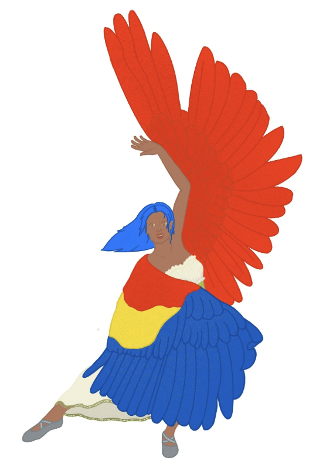

The Avenari are a relatively new species, native only to the Aeolian Archipelago. When humans were forced to the tops of the mountains after the seas rose, they entered the domain of the birds. Nobody knows whether humans slowly started looking like birds or birds started taking on humanoid characteristics, but the result of hundreds of years of coexistence is a wide variety of bird-human hybrids - collectively called the Avenari. No two Avenar are exactly alike, with some traits more heavily pronounced than others. Some Avenari may have the head of a bird, others may only have feathers or the eyes of a bird. Most Avenari have wings and arms, but some might have fully-formed human hands while others have talons. It’s entirely possible for some Avenari to pass as a human when their wings are hidden, and it’s also possible for some Avenari to disguise themselves as large birds flying off in the distance. Regardless of their appearance, Avenari tend to flock together, forming tight-knit communities and lifetime bonds. Although they can be slightly territorial at times, Avenari are generally accepting and tolerant of other species, with some non-traditional Avenari even forming flocks with other species. Members of species are seen to express specificity in skills of Bartering, Deception, Thievery, Awareness, & Foraging

---

## Parrot

Sporting colorful plumage, parrots are smart, proud and attention-seekers. Parrots love nothing more than showing off their knowledge or skills, making them excellent entertainers. They come equipped with a set of colorful wings that allows them to fly as fast as they can walk.

### Special Abilities

The charming visage of the parrot’s feathers allows them to make friends in any situation. When they make a Charm or Leadership check, add an extra point.

### Special Weaknesses

While their plumage is highly charming, it also makes parrots the center of attention wherever they roam. When they make a Sneakiness check, they lose a point.

---

## Pigeon

The most common subspecies, Pigeons can be found in virtually any environment, although they prefer to flock in large settlements. Pigeons tend to be skittish and shy, taking flight when startled or threatened.

### Special Abilities

Pigeons come equipped with nondescript yet effective wings and Hyperawareness. Unlike parrots, their wings are far more plain Jane, but are twice as effective, with an air speed reaching twice their ground speed. On the other hand, Hyperawareness allows pigeons to pick up on the slightest changes in the environment. Add an extra point for checks using Intuition.

### Special Weaknesses

Despite their hyperawareness, pigeons are more susceptible to loud sounds and bright flashes. Following one of these events, subtract two from and roll made and Hyper Awareness cannot be used.

---

## Pelican

Often seen on docks or at sea, Pelicans are the most resilient and tough Avenari. Pelicans take pride in their work and stay grounded where others might falter.

### Special Abilities

Pelicans have a large set of black and white wings, allowing them to fly as fast as they walk. Additionally, a large expandable pouch in their throat allows them to store up to 30 pounds with a reasonable volume, and items are quickly retrievable and cannot be stolen. Their throat expands to accommodate whatever is being stored.

### Special Weaknesses

Pelican health is directly tied to the surrounding environment, making it difficult to navigate artificial hazards. Whenever making a check using something that produces pollution, take a -2 penalty.

---

## Penguin

The most suited for traveling the high seas, Penguins are more comfortable riding the waves than the wind. Penguin Avenari are rare and slightly eccentric, but they always make a splash wherever they turn up.

### Special Abilities

Although they don’t have wings, Penguin Avenari characteristics optimize their body for swimming, allowing them to swim twice as fast as they walk. Unlike other birds, its traits help absorb more damage, known as a blubber buffer. Whenever you take harm, decrease the amount taken by 1.

### Special Weaknesses

While flippered hands are great for swimming, they lack the dexterity of claws or human hands. Whenever you make a Vehicles, Thievery, or Shooting check, subtract 2 from the total.

---

## Peacock

Trend setters and pioneers, when Peacocks turn on their charm nobody can look away. Although they’re known for being flamboyant, Peacock Avenari are very perceptive and understand how to deftly navigate tricky situations.

### Special Abilities

Peacocks have a set of beautiful tail feathers and short wings, allowing them to fly half as fast as they walk. Their tail feathers can endear even the most stoic person, and once per day, they can spread their tail feathers as an action, forcing everyone of their choice that sees them to make a Personality check. On a failure, the target becomes friendly to the peacock for the rest of the day. Note: the target retains their free will and can still become hostile if provoked.

### Special Weaknesses

Peacock wings aren’t meant for long flight and its tail feathers are quite heavy, so Peacock Avenari can only fly in short bursts. Whenever they fly, they must land after one minute. When flying in combat, they must land at the end of each movement.

---

## Puffin

Among the most intelligent of the Avenari, Puffins tend to find themselves working with machinery and technology. While their small bodies lack force and they can be clumsy, a skilled Puffin will easily outmaneuver a stronger (but dumber) foe.

### Special Abilities

Equipped with a small set of black and white wings, Puffins fly half as fast as they can walk. Their wings also work well in water, allowing them to swim half as fast as they walk. Puffins are also notorious seaside technicians, able to easily recognize and tinker with technology. Whenever you make a Vehicles, Cybernetics, or Mechanics check, add an extra point to the roll.

### Special Weaknesses

Puffin Avenaris’ small frame and hollow bones make physical feats of strength difficult. Whenever you make a Force or Reaction check, subtract 2 from the roll.

---
