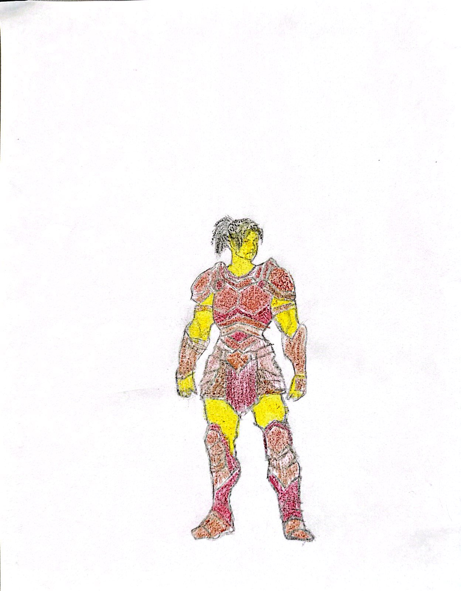
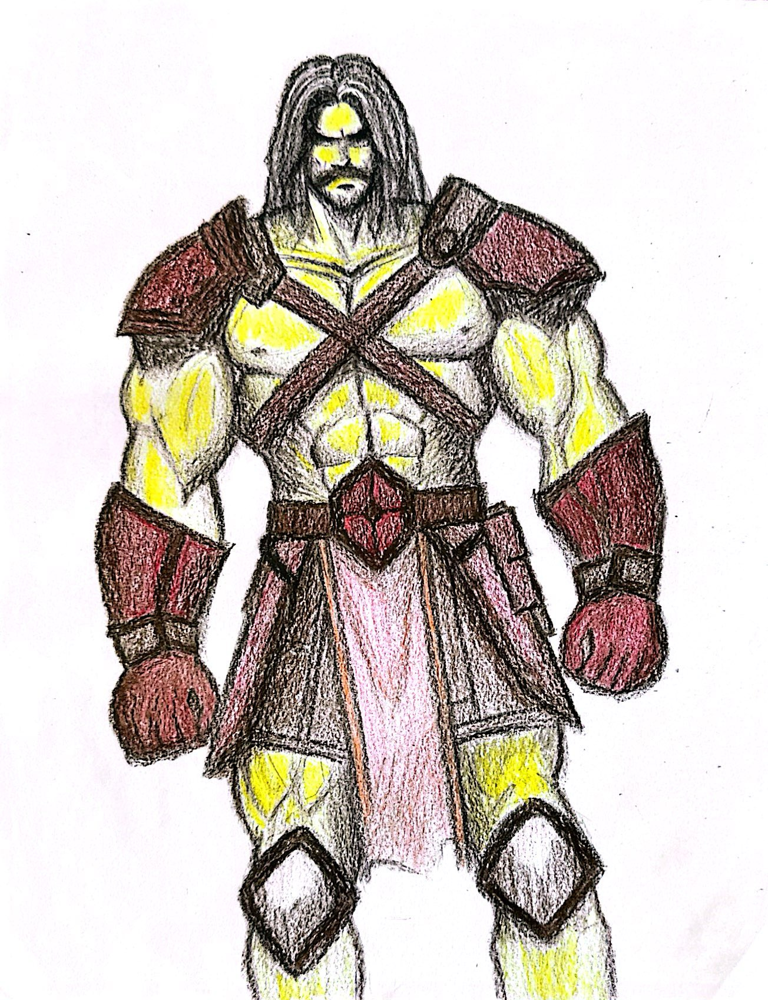

- **Creature Type:** Humanoid
- **Size:** 7-9 feet tall
- **Special Skills**
  - Super Strength
  - Agricultural Knowledge

- **Creature Type:** Humanoid
  - +1 to Strength
- **Size:** 7-9 feet tall
- **Special Skills**
  - Super Strength
  - Agricultural Knowledge
- **Unique Skill**
  - Night Vision (Strength) – they can turn on their night vision at will which in turn makes their skin stops glowing, making them undetectable at night.
- **Unique Disadvantage**
  - Metabolic Strain - Their large size and strength require significant food and water intake, making survival in resource-scarce environments challenging.
- **Skills for character creation**
    - **Charm (Personality)** - how well you can get people to like you
    - **Leadership (Personality)** - persuading or organizing people, getting people to trust you
    - **Awareness (Intuition)** - how attuned you are to your surroundings
    - **Deduction (Knowledge)** - ability to process information and figure things out
    - **Force (Strength)** - hand-to-hand combat and melee, as well as general strength (lifting, pushing, carrying, etc)

# Description
Bulkavs are descendants of humans from a nuclear power plant site who decided to try and live on the island and rebuild above ground. Consequently they became exposed to the radiation at the surface and mutated to become a new species known as the Bulkavs. They are humans with enhanced characteristics like increased size, strength and glow in the dark skin that ultimately led to them becoming nocturnal and only function at night. They are standing at about 8 feet tall on average, and have 4 limbs, like their ancestors. Their skin during the day time has yellow hues, but at night their glow in the dark powers shine though and their bodies illuminate with a soft yellow light, similar to a firefly. Their eye colors can vary between green, brown, and hazel. For their hair, it is traditionally grown out, worn long by the males and females and sometimes can be seen worn in braids.  

**Female Bulkav**            |  **Male Bulkav**
:-------------------------:|:-------------------------:
  |  