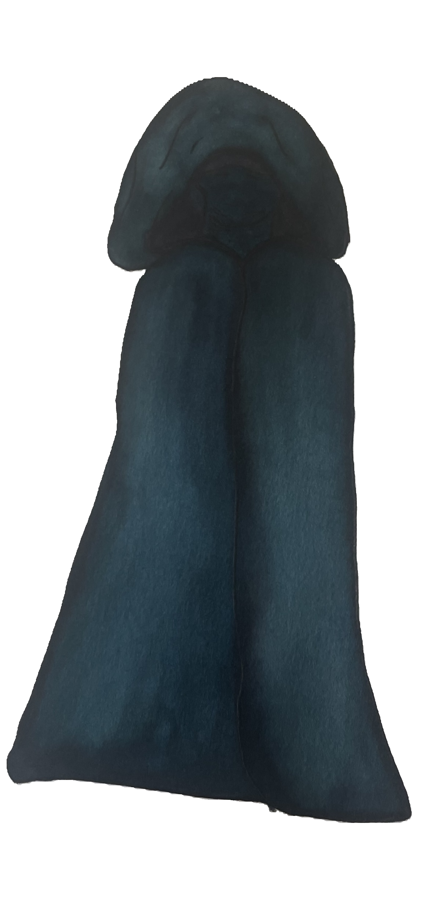

_“Until the day they return to the old world, they will be the Wanderers of this one.”_

Water levels have risen, lands have eroded and shifted, and the air itself has grown toxic to the life that has once inhabited and ruled over it–the human race. Through time and toxic radiation, humans have mutated to new species or merged with existing ones. Even flora and fauna themselves have turned into mutations. In Atlantis, the last of the human species have made a claim of a new home. A protected bubble, funded by Frontier. It is thought that humans who were unable to make it to Atlantis were unable to adapt to the harsh environment of this brand new world full of monsters and hybrids and perished. However, humans are stubborn as they are fickle. These humans called Wanderers have managed to survive throughout the years where this planet, once known as Earth, has evolved past them. A lineage of people who have always known how to get by, living on boats as if they were islands themselves. These humans who have been pushed to the edges of civilization and to the brink of death now scavenge and search for a home that has been long forgotten.

## Special Abilities

Wanderers have been passing down their stories for generations, preserving what they can about the histories of the old world. Gathering data about the mass extinction and effects of global warming by reaping sunken and buried artifacts, they use their knowledge to craft ideas, mechanisms, and community. Due to the ties of their longstanding history, all Wanderers have some level of knowledge of a culture they might have once had ties to. They come equipped with one additional knowledge point. The species also have an urge to return that will have Wanderers always finding their way back to where they began. They have excellent directional ability and environmental expertise and gain a +2 to Tracking. You may pick a speciality in tracking that might relate to this urge. This specialization leads you to gain advantage on any Tracking checks related to your specialty. For example, you may play a Wanderer who wants to piece together his family tree, resulting in a speciality in tracking people. In addition, you do not get lost easily if you are trying to navigate an area that you have been to before–even in the dark, your feet will lead you to your destination.

## Skills for Character Creation

-   Mechanics
-   Vehicles
-   Awareness
-   Reaction
-   Tracking

## Special Weaknesses

Wanderers are very wary of nonhuman species and can be perceived as closed off. As outcasts themselves, they have grown quite skillful in resourcefulness, their greatest setback is their nature of distrust that limits the number of outsiders they allow in their community, due to the fear of being infected with mutations.

## Social Hierarchy

A group of Frontier laborers at the bottom rung of the corporate ladder once began gathering Frontier technology for themselves, their families, and civilians that their higher-ups have left in the dark. This was long before the death of the old Earth. Knowing where Frontier was heading with its projects and that they were about to irreversibly damage the Earth’s climate and environment, these laborers united to build a ship to survive any flood, weather, and radiative effects–a final bastion, a final chance at survival. Using stolen Frontier tech, they were able to achieve great things. The descendants of this group of Frontier laborers began to form a leading council called Maintenance, whose descendants carry on the flame of their ten titles. However, this Maintenance remains to keep their historic ties to Frontier hidden as they push this monopoly as a shared enemy of humanity. These are people who have been left behind by their leaders, their economy, and their oppressors. They have cultivated their knowledge and code of conduct against those that control, that indulge, that restrict. This human society might be secretive, but their veiled identities are accounted for by their visage and their hard-to-reach, mostly-nomadic settlements. With gas masks and equipment or layers of clothing to keep them safe from the environment, it can be hard to tell that the Wanderers that outsiders interact with are human. Even if this might not always be the case, an adventure towards the Wanderer’s Edge of Civilization is a trek not many take, leading this group of humans mostly undiscovered by the general population. Though uncommon, some outsiders who have made the journey to the Edge mingle with more open-minded Wanderers at standing sites, or have somehow attracted the heart of a Wandering family who will accept them as their own. Most Wanderers tend to be wary of non-human species, worried that close contact will infect them with some sort of mutation as well. The Ark sees great use in keeping a watchful eye on all the other species while they try to maintain humanity. They are wise enough to know to collaborate with those in the mainlands, where many resources lie. They keep a few outsiders around the Ark for this reason, liasoning with them to at least keep peace and keep up trade. In addition to this resourcefulness in barter, Wanderers plunder Frontier projects, vehicles, or resource trade-in sites for valuable necessities. Although most travel with The Ark, these viking-like Wanderer communities all have their complex, individual values, traditions, and ways of life.
