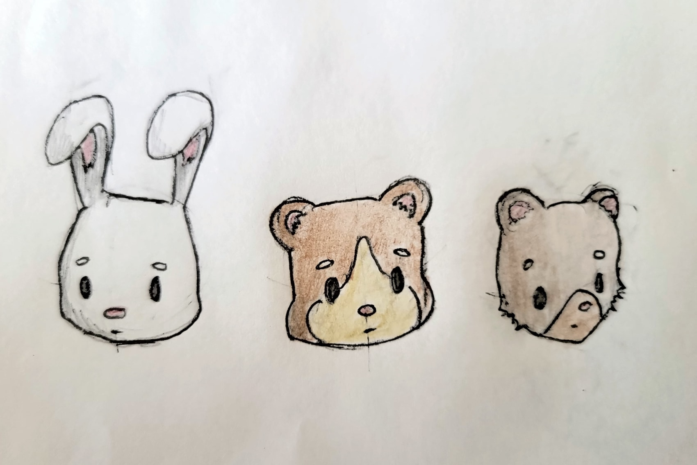
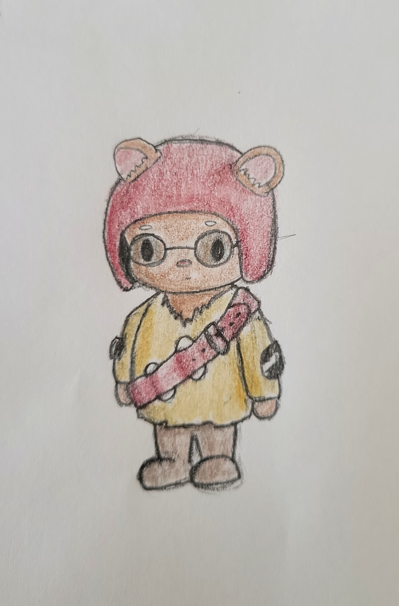

This species consists of humanoid woodland creatures. These creatures can be squirrels, chipmunks, bunnies, or any other small rodent-like animal. The creatures, independent of what type of real-world animal they are based on, are bipedal creatures that have opposable thumbs and the ability to speak. Although not originally from desert landscapes, they have adapted by fashioning themselves rudimentary technology into wearable devices that help recapture lost moisture from breathing. This technology is made of poorly welded scrap metals and cloth to create a filtering mask that keeps water in and sand out. Their fur and clothing vary in color when cleaned, but desert life makes both dirty rapidly. Most creatures can be black, brown, gray, white, orange, yellow, or some combination of those, but most of the time they are hued muted dust colors as the sand gets into all nooks of their fur and materials. 

## Special Abilities
Woodland creatures come equipped with agility, adding one point. They also have the unique gift of healing, in which they can partially restore any living creature or inanimate object by restoring 1 harm. However, this costs a portion of their own lifeforce, causing proportional reduction to harm. 

## Skills for Character Creation
- Sneakiness
- Foraging
- Mechanics
- Bastering
- Awareness

## Special Weaknesses
A weakness unique to the woodland creatures is compulsion; if food or water is discovered, they must immediately stop their activity and divide it among themselves. Refusing to share is considered undermining the pack and leads to conflict. 

## Social Hierarchy
As a species, they hold the most value in community. Since their lives are defined by a lack of basic goods, they function better as a collective since this allows them to distribute any materials efficiently and every individual has a better chance of survival because of it. Undermining the pack is a life or death matter and is punished with banishment, which is usually unsurvivable. In addition to community, they also place a high value on storytelling. In a land that lacks many written materials, these creatures find that passing information through speaking is the only way to pass it down generations. They hope that one day plants will return, but until then they must keep the knowledge alive of how to cultivate them. Because of this, the species have a regular pastime of storytelling, both fictional and not, to pass on values and information. 

