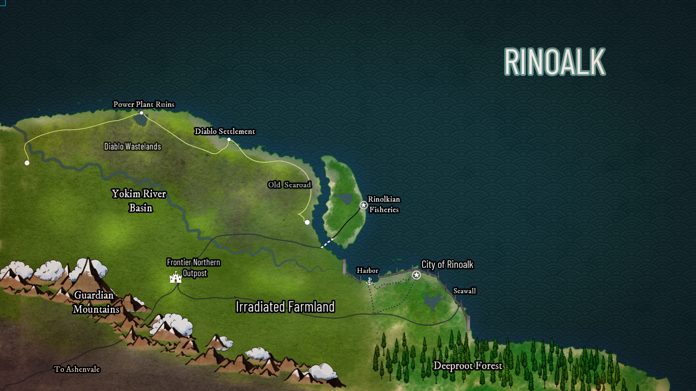

import { LinkCard, CardGrid } from '@astrojs/starlight/components';

A long long time ago, many people lived near the Diablo Power Plant, which today is known as Rinoalk. As the sea levels continued to rise eventually the powerplant had to be abandoned leading to a massive meltdown on the north side. The local inhabitants majority decided to seek refuge under water and eventually build the city of Karkorte. However, a few small tribes decided to stay on the island and fled to the mountains to avoid the rising sea levels, knowing the water would soon take over the powerplant side. After years hiding in the mountains, they were able to return to the opposite side of the island from the powerplant and tried to rebuild. These brave folk had to adapt to the radiation on the island and created the city of Rinolk.

Over time these fumes and radiation mutated the humans and turned them yellow, it also caused them to become nocturnal, they glow in the dark and can only perform their tasks and use their “powers” at night. As they adapted, they weren’t quite human anymore, and decided to go by the name Bulkavs. One of these Bulkavs, known as Rino, was able to develop incredible knowledge that allowed them to lead the Bulkavs to survival at the surface and ultimately led to the development of the city Rinoalk where farmers and engineers thrive. Rino eventually became king of the city, and has been a fair ruler. The city of Rinolk was named after him who is still highly praised to this day. The throne has been passed down generationally and the current descendant is Rino the 247th.

One of Rino’s great inventions was a special fertilizer that allowed for plants to grow in the radioactive soil. This allowed for special crops to be grown that have special radioactive properties. These crops gained the interest of Frontier, and is the main export of Rinolk, and what allows the city to be so prosperous.

However as time went on sea levels continued to rise and they began to face hardship and needed to begin building a sea wall in order to save their town. This is where the engineers come in, as the Bulkavs began building sea walls they furthered their knowledge in engineering and developed advantageous techniques to combat the rising sea levels. This sea buffer allowed the Rinoalkian citizens to begin advancing their infrastructure and their farming techniques further inland behind their seawall and maintain a self-sufficient society with the descendants of the Bulkavs being at the helm.

Since the establishment of this city, they have not had many outsiders come in. Frontier’s businessmen are the primary visitors to the island of Rinolk, and other than them the only outsiders are some occasional wandering traders that come in peace to visit the nice town of Rinolk. Rinolkian citizens are not aggressive nor do they pose a threat to outsiders, however if provoked or disrespected they are more than capable of defending themselves and fighting back. Outsiders must be careful when coming to Rinolk because they mostly only speak Rinolkian, which comes from English descent, but has been changed significantly throughout the centuries. Their lands are surrounded by untapped natural resources, other than their farmland, that they have decided to leave for now given that there is no reason to obtain them yet, but they are willing to provide some of their goods to others whether it be by selling or through their trading system.

Their peaceful and positive society was not relatively hard to obtain given their good morals and ambition to succeed as a society. They do not hesitate to share resources including food, ideas, and medicine when others are in need because they feel as though they must work together in order to achieve the best versions of themselves. This might also be due to the fact that their comradery has allowed them to build strong relationships with one another as they don't really have much to do for fun except interact with each other and talk to one another.

Rinoalk’s technology is not too advanced yet. They work mainly with pickaxes, shovels, hammers, and wheelbarrows when it comes to engineering and swords with bows and arrows when it comes to combat against monsters. This is due to the fact that Rinoalk is still fairly primitive as they have had to keep on the move, trying to avoid the rising sea levels. When they first built the city many important buildings were placed right along the coast that are now in danger. However they are not willing to lose such an important aspect of their history and culture therefore they continue to work on the seawall to ensure the safety of their past and their future.

## Infrastructure

There are buildings made of stone. Using a mortar and rocks they were able to create buildings and homes. Our land is a simple town. Most of our technology is for farming, like hoes and other equipment. All of our farm work is done manually. For the building of our sea wall it is done by using ladders and basic pulley systems. We are very strange. The primary transportation is walking, we do not have other transportation modes. The sea wall must be constantly worked on given that the sea levels continue to rise and serve as a threat to the city and its inhabitants. The engineers tend to work on the seawall at night given that they are nocturnal and also that is when the tide is the highest, therefore during the day when they rest they know the water will not pose a threat to rise as high as the wall.

## Politics

The system of government is a royal hierarchy with one king who decides what's best for the city. Everyone else in the city has a niche that they must occupy whether it be as a warrior or an engineer/farmer. There are other small niches that people may choose for example fishermen or hunters/gathers. Women also have the ability to choose what they would like to do for work which can include being a warrior or engineer also.

## Quality of life

Residents here live a relatively peaceful life, during the day they sleep and rest given that they are nocturnal and they perform all important tasks at night given that they can see due to their glow in the dark skin. For recreation the children attend school that teaches them simple cultural customs and languages and for fun they enjoy roaming nature and playing with one another.

## Purpose

Rinoalk is known for their food production given that they own the recipe to the fertilizer that allows them to grow crops on radioactive soil. They also obtain a variety of fish farms on the coast where they tend to many species of fish and extract very delicious caviar from them also.

## Campaigns in Rinoalk

<CardGrid>
    <LinkCard
        title="Coastal Crisis"
        href="/docs/campaigns/coastal-crisis/mission-1"
        description="Face a powerful storm and hostile sea creatures to unravel the truth behind the myserious radiation corrupting the Turtius nests."
    />
</CardGrid>
